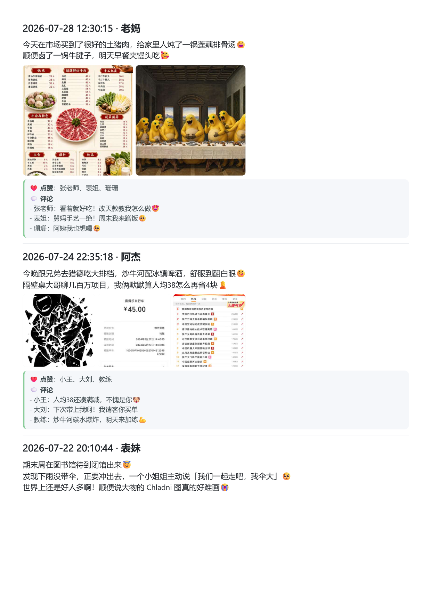

<p align="center">
  
  
  
</p>

<h1 align="center">📱 wxMoments</h1>
<p align="center"><b>微信朋友圈导出备份工具</b></p>
<p align="center">把你的朋友圈文案、图片、互动全部保存到本地</p>

<p align="center">
  <a href="#-features">功能</a> ·
  <a href="#-screenshots">效果预览</a> ·
  <a href="#-quick-start">快速上手</a> ·
  <a href="#-tech">技术说明</a>
</p>

---

## 💡 为什么做这个项目？

**你有没有想过：**

如果有一天微信不能用了，或者你换号了，那些年的朋友圈还在吗？

- 2016 年在洱海边发的九宫格
- 奶奶第一次学会用微信给你点的赞
- 毕业那天室友在评论区哭成狗
- 凌晨三点加班完随手拍的月亮和朋友的调侃

这些回忆，**不应该只活在腾讯的服务器里**。

wxMoments 可以把它们全部下载到你电脑上——**Markdown / HTML / PDF 三种格式**，离线也能看，想怎么存就怎么存。

---

## ✨ 功能

| 功能 | 说明 |
|------|------|
| 📄 **导出格式** | Markdown · HTML · PDF |
| 🖼️ **完整还原** | 文案 + 九宫格图片 + 位置 + 点赞 + 评论 |
| 👥 **好友筛选** | 只导出某个人的朋友圈，或导出所有人 |
| 📅 **时间范围** | 指定起止日期，只导你想要的时间段 |
| 📋 **好友列表** | 导出通讯录（wxid / 昵称 / 备注 / 隐私状态） |
| 🧭 **覆盖报告** | 生成 `coverage.json`，提示本地缓存最早/最晚记录和明显断档 |
| 🔑 **自动密钥** | Windows 自动获取数据库密钥，无需手动操作 |

---

## 🖼️ 效果预览

<p align="center">
  
  
</p>

---

## 🚀 快速上手

**Windows：**

```bash
# 1. 下载项目
git clone https://github.com/claudemt/wxMoments.git
cd wxMoments

# 2. 直接双击启动！
run.bat
```

首次启动会自动创建 `runtime/.venv` 并安装依赖。仓库已附带 Windows 常用依赖 wheel，优先离线安装；如果你的 Python 版本与内置 wheel 不匹配，会自动联网补齐。

如果电脑上微信文件不在常见目录里，可以在 `config/config.json` 里手动填写 `wechat_data_root`，直接指向微信数据目录或账号目录。

或者用 Python 手动运行：

```bash
pip install -r config/requirements.txt
python src/wxmoments.py
```

**macOS：**

```bash
# 1. 下载项目
git clone https://github.com/claudemt/wxMoments.git
cd wxMoments

# 2. 终端运行
bash run.command
```

> ⚠️ 由于 macOS 系统隐私限制，本工具 **无法自动获取数据库密钥**。你需要先用第三方工具提取微信数据库密钥（64 位十六进制字符串），然后在运行时粘贴，或提前填入 `config/config.json` 的 `db_key` 字段。密钥保存一次后会复用，下次无需再填。

按提示登录微信，选择导出内容，坐等导出完成 🎉

---

## 🛠️ 技术说明

- 从本机微信数据库读取朋友圈数据，不联网、不窃取隐私
- Windows 自动获取数据库及图片解密密钥，Mac 须手动填写
- 依赖按 `config/requirements.txt` 整体安装/修复，避免运行到一半才因缺库崩溃
- 运行环境、日志、缓存数据库统一放在 `runtime/`，导出结果放在 `output/`
- 微信内置表情 shortcode 会在 Markdown / HTML / PDF 中统一转换为更自然的 emoji
- PDF 默认使用 Chrome / Edge 无头模式渲染，保留系统 emoji 字体；未检测到浏览器时自动回退
- 兼容 PC 微信 3.x / 4.x 常见本地缓存结构；实际可导出范围取决于本机微信缓存

## 🤝 贡献

欢迎提 Issue 和 PR！如果你有想法，欢迎来聊：

- 找到了 Mac 系统自动提取 db_key 的方案？
- 发现了新的微信版本兼容问题？

---

<p align="center">
  <b>如果这个项目对你有帮助，欢迎 ⭐ Star ⭐ 让更多人看到</b>
</p>
